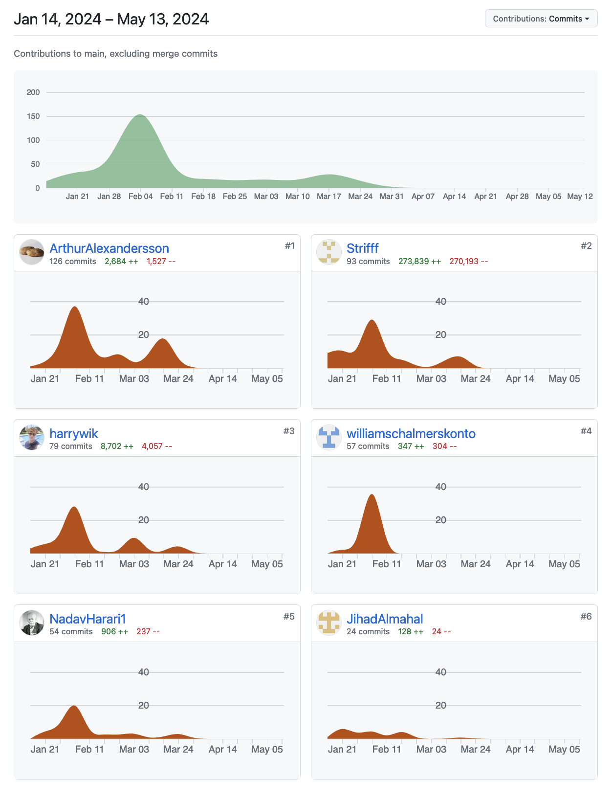

# DATX11, Group 61, Requirements Extraction Thesis

## Abstract 

[Context] Manually extracting requirements from standard documents is a time-
consuming task. Due to the advancements in Generative AI (GAI), companies are
now exploring its integration into the task of requirement extraction. [Gap] How-
ever, there is currently a lack of research regarding performance of different models,
prompt types and standard documents for this task. Furthermore, as progress in GAI
continues, the need for continuous evaluation of performance becomes increasingly
important. [Method] A pipeline consisting of three modules were implemented: data
ingestion, model invocation and evaluation. The Large Language Models (LLMs)
used were the Llama2 7B-q4_0 model and Copilot Enterprise. The pipeline extracts
requirements from a subset of pages from standards, issued by IEC, ISO, and IEEE,
using two different prompt patterns, few-shot and zero-shot, for each of the LLMs.
A Gold Standard (GS) was created in combination with a labeling software for
Interrater Reliability to evaluate performance with sufficient agreement. [Results]
On an aggregate level, the thesis concluded that the two models performed simi-
larly in terms of F1-score. Contrary to previous studies evaluating prompt patterns,
zero-shot outperformed few-shot. A difference of performance between the different
standard types were apparent, with extractions from standards issued by IEC and
ISO outperforming the IEEE issued document. This thesis further establishes a per-
formance framework that can be used or referenced in future studies evaluating the
performance between two models.

## 

## Original repository contributions

Strifff = Axel Solhall